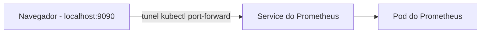
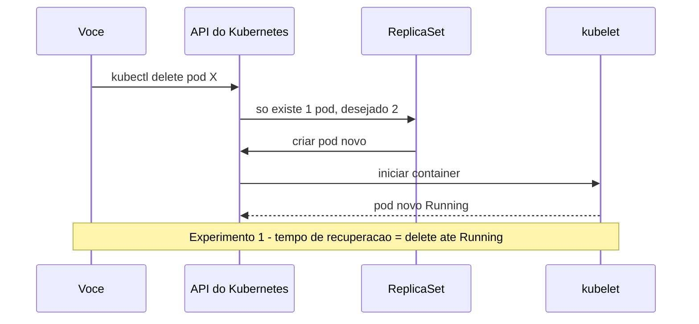
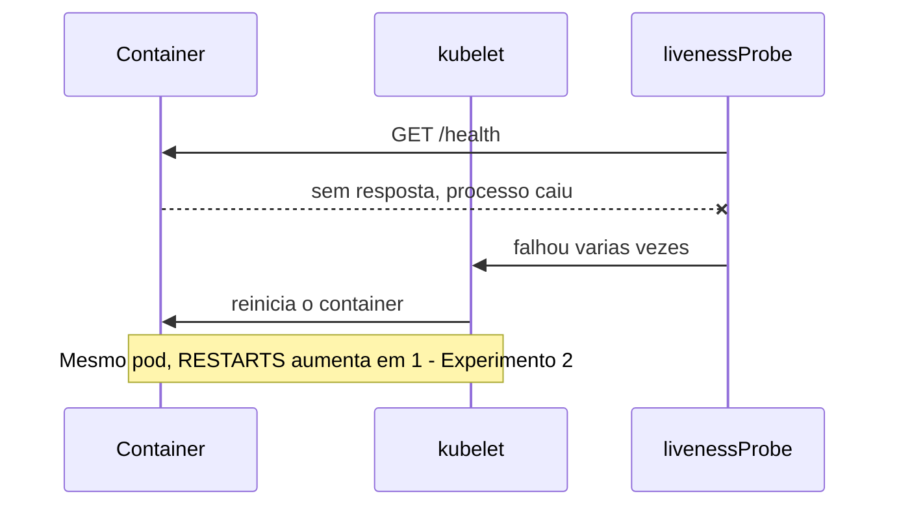
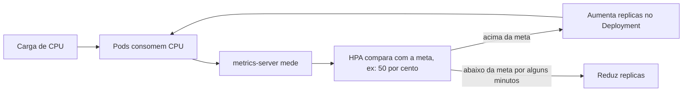
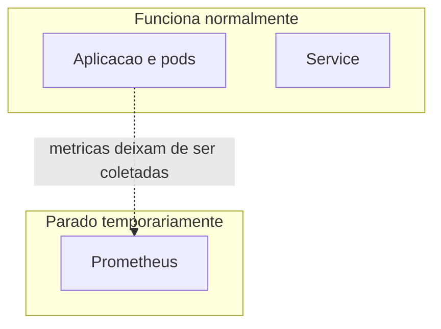

# Atividade 4 – Tolerância a Falhas e Monitoramento com Kubernetes + Prometheus

Disciplina de Sistemas Distribuídos (2026.2) · Trabalho individual

---

## Sumário

1. [Objetivo](#1-objetivo)
2. [Conceitos básicos de Kubernetes](#2-conceitos-básicos-de-kubernetes)
3. [Arquitetura do projeto](#3-arquitetura-do-projeto)
4. [Ferramentas utilizadas](#4-ferramentas-utilizadas)
5. [Estrutura de pastas](#5-estrutura-de-pastas)
6. [Passo a passo do ambiente (o que já foi feito)](#6-passo-a-passo-do-ambiente-o-que-já-foi-feito)
7. [Problema encontrado e solução](#7-problema-encontrado-e-solução)
8. [Checklist de verificação](#8-checklist-de-verificação)
9. [Como funcionam os mecanismos da atividade](#9-como-funcionam-os-mecanismos-da-atividade)
10. [Próximos passos](#10-próximos-passos)
11. [Comandos úteis do dia a dia](#11-comandos-úteis-do-dia-a-dia)
12. [Entrega](#12-entrega)

---

## 1. Objetivo

Implantar uma aplicação distribuída em um cluster Kubernetes local (Minikube) e demonstrar:

- **Tolerância a falhas e auto-recuperação** (o Kubernetes recria o que quebra);
- **Escalonamento horizontal** (mais réplicas quando a carga sobe, via HPA);
- **Monitoramento** com Prometheus.

Requisitos da aplicação: 2 réplicas iniciais, `Deployment`, `requests` e `limits` de CPU,
`livenessProbe` e `HorizontalPodAutoscaler`. A aplicação deve ser diferente das
desenvolvidas anteriormente na disciplina.

Experimentos a realizar:

| # | Experimento | O que prova |
|---|-------------|-------------|
| 1 | Deleção de Pod | O Kubernetes recria pods removidos (auto-recuperação) |
| 2 | Falha no container | O Kubernetes reinicia containers que falham (`RESTARTS`) |
| 3 | Sobrecarga de CPU | O HPA aumenta e diminui o número de réplicas |
| 4 | Interrupção do Prometheus | Falha no monitoramento ≠ falha na aplicação |

---

## 2. Conceitos básicos de Kubernetes

Kubernetes (K8s) é um **orquestrador de containers**. Em vez de você subir containers
manualmente, você **descreve o estado desejado** ("quero 2 cópias da minha app sempre
rodando") e o Kubernetes trabalha continuamente para fazer a realidade bater com essa descrição.

| Termo | O que é | Analogia |
|-------|---------|----------|
| **Cluster** | Conjunto de máquinas gerenciadas pelo Kubernetes. No Minikube é só 1 máquina (um container Docker). | A fábrica inteira |
| **Node** | Uma máquina do cluster onde os pods rodam. | Uma bancada da fábrica |
| **Pod** | Menor unidade do K8s. Envolve 1 (ou mais) container(s). Tem IP próprio e é **descartável**. | Um funcionário |
| **Container** | O processo da aplicação, empacotado em uma imagem Docker. | A tarefa que o funcionário executa |
| **Deployment** | Declara "quero N réplicas deste pod" e mantém esse número. Cria os pods via ReplicaSet. | O gerente que mantém a equipe completa |
| **ReplicaSet** | Criado pelo Deployment; garante que N pods existam. | A lista de presença do gerente |
| **Service** | Endereço estável (IP/DNS) que distribui tráfego entre os pods. Pods morrem e mudam de IP; o Service não. | A recepção, que sempre atende no mesmo número |
| **Namespace** | Divisão lógica dentro do cluster. Usamos `monitoring` (Prometheus) e outro para a app. | Departamentos |
| **Probe (liveness)** | Teste periódico de "você está vivo?". Se falhar repetidamente, o container é reiniciado. | Verificar o pulso |
| **requests / limits** | `requests` = CPU/memória garantida e usada para agendar; `limits` = teto máximo. | Cota mínima e máxima |
| **HPA** | HorizontalPodAutoscaler: aumenta/diminui réplicas conforme uma métrica (CPU). | Contratar/dispensar funcionários conforme a demanda |
| **metrics-server** | Coleta uso de CPU/memória dos pods. **O HPA depende dele.** | O medidor de consumo |
| **Helm** | Gerenciador de pacotes do K8s. Instala conjuntos grandes de recursos com 1 comando. | O "apt/npm" do Kubernetes |
| **kubectl** | A linha de comando para falar com o cluster. | O controle remoto |

### Diferença-chave (será pedida no Experimento 2)

- **Reiniciar um container**: o pod continua o mesmo (mesmo nome, mesmo IP); só o processo
  interno é reiniciado pelo `kubelet`. O contador `RESTARTS` aumenta.
- **Recriar um pod**: o pod antigo some e um **novo** pod (novo nome, novo IP) é criado pelo
  ReplicaSet. O contador `RESTARTS` começa do zero.

---

## 3. Quem fornece qual métrica

| Requisito do enunciado | Fonte da métrica | Consulta PromQL (exemplo) |
|------------------------|------------------|---------------------------|
| Número de pods ativos | kube-state-metrics | `count(kube_pod_status_phase{phase="Running", namespace="app"})` |
| Uso de CPU | cAdvisor (kubelet) | `sum(rate(container_cpu_usage_seconds_total{namespace="app"}[1m]))` |
| Estado dos pods | kube-state-metrics | `kube_pod_status_phase{namespace="app"}` |
| Reinicializações | kube-state-metrics | `kube_pod_container_status_restarts_total{namespace="app"}` |
| Alterações do HPA | kube-state-metrics | `kube_horizontalpodautoscaler_status_current_replicas` |

> As consultas acima são pontos de partida. É preciso ajustar o `namespace` quando a aplicação existir.

---

## 4. Ferramentas utilizadas

| Ferramenta | Função no projeto |
|-----------|-------------------|
| **WSL2** | Camada de Linux dentro do Windows, usada pelo Docker Desktop |
| **Docker Desktop** | Executa containers; o Minikube roda "dentro" dele (`--driver=docker`) |
| **Minikube** | Cria um cluster Kubernetes local de 1 node |
| **kubectl** | CLI para operar o cluster |
| **Helm** | Instala o Prometheus com um único comando |
| **kube-prometheus-stack** | Chart do Helm que instala Prometheus + operator + kube-state-metrics + node-exporter |
| **Prometheus** | Coleta e armazena métricas, com linguagem de consulta PromQL |

---

## 5. Estrutura de pastas

```
app-k8s-prometheus/
├── app/                        # Código da aplicação
│   ├── app.py                  # A aplicação (endpoints /health, /cpu, /crash, /metrics)
│   ├── requirements.txt        # Dependências Python
│   ├── Dockerfile              # Receita para construir a imagem
│   └── .dockerignore           # Arquivos ignorados no build
├── k8s/                        # Manifestos Kubernetes (YAML)
│   ├── namespace.yaml          # Namespace da aplicação
│   ├── deployment.yaml         # 2 réplicas, requests/limits, livenessProbe
│   ├── service.yaml            # Endereço estável para os pods
│   ├── hpa.yaml                # Autoescalonamento por CPU
│   └── servicemonitor.yaml     # Diz ao Prometheus para coletar métricas da app
├── monitoring/
│   └── values.yaml             # Configurações opcionais do Prometheus (Helm)
├── scripts/                    # Um script PowerShell por experimento
│   ├── exp1-delete-pod.ps1
│   ├── exp2-crash-container.ps1
│   ├── exp3-carga-cpu.ps1
│   └── exp4-parar-prometheus.ps1
├── evidencias/                 # Prints e logs que irão para o relatório
├── relatorio/                  # Relatório final em PDF
└── README.md                   # Este arquivo
```

**Por que separar assim?** `app/` é código; `k8s/` é infraestrutura declarativa;
`scripts/` automatiza os experimentos para que sejam repetíveis (e gravados no vídeo);
`evidencias/` e `relatorio/` guardam o que será entregue.

---

## 6. Passo a passo do ambiente (o que já foi feito)

Todos os comandos abaixo foram executados no **PowerShell**.

### 6.1 Pré-requisitos

- Windows 10 (2004+) ou 11, com virtualização habilitada na BIOS;
- 8 GB de RAM no mínimo (16 GB ideal);
- wsl e docker instalados.

### 6.2 Instalar kubectl, Minikube e Helm

```powershell
winget install Kubernetes.kubectl
winget install Kubernetes.minikube
winget install Helm.Helm
```

`winget` é o gerenciador de pacotes do Windows. Depois, **fechar e abrir o PowerShell**
para o `PATH` ser atualizado, e conferir:

```powershell
kubectl version --client
minikube version
helm version
```

### 6.3 Iniciar o cluster Minikube

```powershell
minikube start --driver=docker --cpus=4 --memory=4096
```

| Parte | Significado |
|-------|-------------|
| `minikube start` | Cria e inicia o cluster local |
| `--driver=docker` | Usa o Docker como base (sem VM separada, como o enunciado permite) |
| `--cpus=4` | Reserva 4 CPUs para o cluster |
| `--memory=4096` | Reserva 4 GB de RAM para o cluster |

```powershell
minikube addons enable metrics-server
```

Habilita o **metrics-server**, que mede CPU/memória dos pods. **Sem ele o HPA não funciona.**

```powershell
kubectl get nodes
```

Lista os nodes do cluster. Deve aparecer `minikube` com status `Ready`.

### 6.4 Instalar o Prometheus com Helm

```powershell
kubectl create namespace monitoring
```

Cria o namespace `monitoring`, onde ficará toda a stack de monitoramento,
separada da aplicação.

```powershell
helm repo add prometheus-community https://prometheus-community.github.io/helm-charts
helm repo update
```

- `helm repo add`: registra o repositório que contém o chart do Prometheus.
- `helm repo update`: atualiza a lista de charts disponíveis.

```powershell
helm install monitoring prometheus-community/kube-prometheus-stack -n monitoring --set alertmanager.enabled=false --set grafana.enabled=false --set prometheus.prometheusSpec.serviceMonitorSelectorNilUsesHelmValues=false --wait --timeout 10m
```

| Parte | Significado |
|-------|-------------|
| `helm install monitoring` | Instala uma "release" chamada `monitoring` |
| `prometheus-community/kube-prometheus-stack` | O chart (pacote) a instalar |
| `-n monitoring` | Instala no namespace `monitoring` |
| `alertmanager.enabled=false` | Não instala o Alertmanager (economiza recursos; não é exigido) |
| `grafana.enabled=false` | Não instala o Grafana (idem). Pode ser ligado depois para prints mais bonitos |
| `serviceMonitorSelectorNilUsesHelmValues=false` | Faz o Prometheus enxergar **qualquer** ServiceMonitor do cluster, inclusive o da nossa app |
| `--wait --timeout 10m` | O Helm espera tudo ficar pronto (até 10 min) antes de terminar |

**O que foi instalado:**

- **Prometheus**: banco de métricas;
- **prometheus-operator**: gerencia o Prometheus via recursos do K8s (como o `ServiceMonitor`);
- **kube-state-metrics**: transforma o *estado* do cluster em métricas (pods, restarts, HPA);
- **node-exporter**: métricas da máquina (node).

> As instruções sobre Grafana que aparecem no final da saída do `helm install` são texto
> padrão do chart e podem ser ignoradas, pois o Grafana está desabilitado.

### 6.5 Acessar a interface do Prometheus

Em um **PowerShell separado**, que deve permanecer aberto:

```powershell
kubectl port-forward -n monitoring svc/monitoring-kube-prometheus-prometheus 9090:9090
```

O Prometheus roda **dentro** do cluster e não é acessível de fora. O `port-forward` cria um
túnel: `localhost:9090` no seu PC → serviço do Prometheus dentro do cluster.
Depois, abra `http://localhost:9090`.



---

## 7. Problema encontrado e solução

**Sintoma:** o primeiro `helm install` terminou com

```
Release monitoring has been cancelled.
Error: INSTALLATION FAILED: context canceled
```

e a segunda tentativa com

```
Error: INSTALLATION FAILED: release name check failed: cannot reuse a name that is still in use
```

**Causa:** a primeira instalação foi interrompida no meio, mas o Helm já havia registrado a
release `monitoring` (em estado falho). Na segunda tentativa, o nome ainda estava ocupado.

**Solução:**

```powershell
helm uninstall monitoring -n monitoring     # remove a release fantasma
kubectl get pods -n monitoring              # confirma que não sobrou nada
helm install monitoring prometheus-community/kube-prometheus-stack -n monitoring ... --wait --timeout 10m
```

**Lição:** a instalação demora vários minutos sem mostrar saída. Não interromper com Ctrl+C.
Para acompanhar, abrir outro terminal e rodar `kubectl get pods -n monitoring -w`.

Resultado final: `STATUS: deployed`.

---

## 8. Checklist de verificação

Marque conforme confirmar:

- [ ] `docker run hello-world` funciona
- [ ] `kubectl get nodes` mostra o node `Ready`
- [ ] `kubectl top nodes` retorna números (prova que o metrics-server funciona)
- [ ] `kubectl get pods -n monitoring` mostra tudo `Running`
- [ ] Prometheus abre em `http://localhost:9090`
- [ ] A consulta `kube_pod_info` retorna resultados

**Prints a guardar em `evidencias/`** (seção "descrição do ambiente" do relatório):

- versões: `docker --version`, `kubectl version --client`, `minikube version`, `helm version`;
- `minikube status` e `kubectl get nodes`;
- `kubectl get pods -n monitoring`;
- tela do Prometheus com `kube_pod_info`.

---

## 9. Como funcionam os mecanismos da atividade

### 9.1 Auto-recuperação (Experimentos 1 e 2)





### 9.2 Escalonamento horizontal (Experimento 3)



Pontos importantes:

- O HPA calcula a utilização em relação ao **`requests` de CPU** do pod. Por isso
  o `requests` é obrigatório: sem ele o HPA não consegue calcular a porcentagem.
- O **scale up** é rápido; o **scale down** é lento de propósito (por padrão ~5 minutos de
  estabilização), para evitar oscilações. Isso é esperado, não é erro.
- O HPA consulta as métricas a cada ~15 segundos.

### 9.3 Interrupção do monitoramento (Experimento 4)



Monitoramento é um **observador**, não parte do caminho da requisição. A aplicação continua
atendendo mesmo sem o Prometheus; o que se perde é a **visibilidade** (e as métricas do
período ficam com um "buraco" no gráfico).

---

## 10. Próximos passos

| Etapa | O que fazer | Arquivos envolvidos |
|-------|-------------|---------------------|
| 1 | Escrever a aplicação (endpoints `/health`, `/cpu`, `/crash`, `/metrics`) e o Dockerfile | `app/*` |
| 2 | Construir a imagem dentro do Minikube e criar Deployment, Service, HPA | `k8s/*` |
| 3 | Criar o ServiceMonitor e testar consultas PromQL | `k8s/servicemonitor.yaml` |
| 4 | Executar os 4 experimentos, medindo tempos e salvando prints | `scripts/*`, `evidencias/` |
| 5 | Escrever o relatório (4 a 6 páginas) e gravar o vídeo (~5 min) | `relatorio/` |

**Dica para o build:** para o Minikube enxergar imagens construídas localmente, rode em cada
PowerShell onde fizer `docker build`:

```powershell
& minikube -p minikube docker-env --shell powershell | Invoke-Expression
```

E no Deployment use `imagePullPolicy: Never` (ou `IfNotPresent`).

---

## 11. Comandos úteis do dia a dia

### Cluster

| Comando | O que faz |
|---------|-----------|
| `minikube status` | Mostra se o cluster está de pé |
| `minikube start` | Liga o cluster (reaproveita a configuração anterior) |
| `minikube stop` | Desliga o cluster, mantendo os dados |
| `minikube delete` | Apaga o cluster por completo (recomeço do zero) |
| `kubectl get nodes` | Lista os nodes |
| `kubectl top nodes` / `kubectl top pods -n <ns>` | Uso de CPU/memória |

### Inspeção

| Comando | O que faz |
|---------|-----------|
| `kubectl get pods -n <ns>` | Lista pods (veja `STATUS` e `RESTARTS`) |
| `kubectl get pods -n <ns> -w` | Igual, mas acompanha em tempo real (`-w` = watch) |
| `kubectl get pods -n <ns> -o wide` | Mostra também IP e node |
| `kubectl describe pod <nome> -n <ns>` | Detalhes e **eventos** (ótimo para ver por que algo falhou) |
| `kubectl logs <pod> -n <ns>` | Logs do container |
| `kubectl get hpa -n <ns> -w` | Acompanha o HPA em tempo real |
| `kubectl get all -n <ns>` | Visão geral de pods, services, deployments |

### Aplicar e remover

| Comando | O que faz |
|---------|-----------|
| `kubectl apply -f k8s/` | Cria/atualiza tudo que está nos YAMLs da pasta |
| `kubectl delete -f k8s/` | Remove tudo que foi criado pelos YAMLs |
| `kubectl delete pod <nome> -n <ns>` | Remove um pod (Experimento 1) |

### Helm

| Comando | O que faz |
|---------|-----------|
| `helm list -n monitoring` | Lista releases instaladas |
| `helm uninstall monitoring -n monitoring` | Remove o Prometheus |

### Dicas

- `-n <ns>` define o namespace. Sem ele, o `kubectl` usa o namespace `default`.
- Se o `port-forward` cair (normal ao trocar pods), basta rodar o comando de novo.
- Dentro do OneDrive, o `docker build` pode ficar lento ou dar erro de "arquivo em uso".
  Se acontecer, pause a sincronização ou mova o projeto para algo como `C:\dev\`.
- Erro de política de execução ao rodar `.ps1`:
  `Set-ExecutionPolicy -Scope CurrentUser RemoteSigned`.
- Se o Minikube ficar lento, reduza recursos (`--cpus=2 --memory=3072`) ou limite o WSL2
  criando `%UserProfile%\.wslconfig` com `[wsl2]`, `memory=6GB`, `processors=4`
  e rodando `wsl --shutdown`.

---

## 12. Entrega

Relatório individual em **PDF, 4 a 6 páginas**, contendo:

- descrição do ambiente utilizado;
- configuração da aplicação e do HPA;
- evidências dos quatro experimentos, com prints legendados;
- prints de comandos e métricas;
- tempos de recuperação e escalonamento;
- breve análise dos resultados;
- **link do vídeo no YouTube** (~5 min) com todas as demonstrações.

Tabela para anotar os tempos durante os experimentos:

| Medição | Início | Fim | Tempo |
|---------|--------|-----|-------|
| Exp. 1 – recuperação após deletar pod | | | |
| Exp. 3 – escalonamento (carga até novas réplicas Running) | | | |